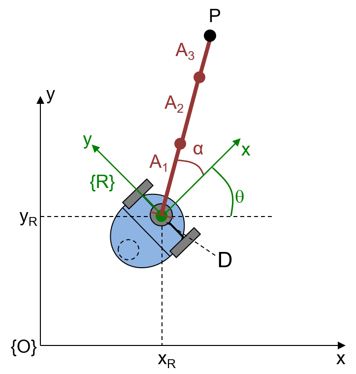
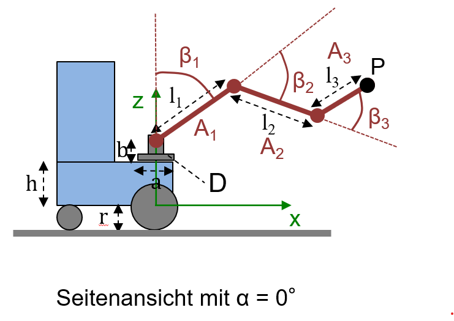

# 3. Ansteuerung eines mobilen Greifarmroboters in ROS2

In dieser Aufgabe lernen Sie das Robot Operating System 2 (ROS2) kennen. Sie werden Ihre ersten Programme (Nodes) dafür
schreiben um den Umgang mit ROS2 und dessen Arbeitsweise kennenzulernen. Zur Strukturierung von verschiedenen
Projekten werden in ROS2 Packages verwendet.

Zur Lösung der Aufgaben können Sie den bereitgestellten Docker Container nutzen.
Die benötigten Dateien und eine kurze Anleitung finden Sie im Verzeichnis [docker](../docker).

## 3.1 ROS2 Packages und Nodes

Erstellen Sie ihr erstes ROS2 Python Package `py_pubsub` welches einen Publisher Node `talker` und einen Subscriber
Node `listener` enthalten soll.

* Der Publisher Node soll jede Sekunden eine String
  Message `„Hello this is my first ROS Node and it runs since 1 seconds.“` auf dem Topic `/chatter` publizieren. Dabei
  sollen die Sekunden immer weiter hochgezählt werden.

* Der Subscriber Node soll diese Nachricht auf dem `/chatter` Topic empfangen und über den ROS Logger auf dem
  Level `info` ausgeben.

Orientieren Sie sich bei Ihrer Implementierung am **ROS2 Tutorial:**

* https://docs.ros.org/en/humble/Tutorials/Beginner-Client-Libraries/Writing-A-Simple-Py-Publisher-And-Subscriber.html

**Hinweis:** Verwenden Sie beim Bauen Ihres Package den Zusatz `--symlink-install`. Dann können Sie in Ihrem Python Code
Änderungen vornehmen, ohne dass Sie das Package neu bauen müssen.

```bash
colcon build --symlink-install
```

## 3.2 ROS2 Ansteuerung eines Gelenkarms

Erstellen Sie ein neues Package `my_jk_rollin_kinematics` zur Ansteuerung des Gelenkarms des Roboters JK_Rollin.
Erweitern Sie hierfür ihr kinematisches Modell aus Task 2 um einen dritten Arm $`A_3`$ wie in Übung 2.5. Es jetzt müssen
also die Gelenkwinkel für `turntable` ($`\alpha`$), `shoulder` ($`\beta_1`$), `elbow` ($`\beta_2`$) und `wrist` (
$`\beta_3`$) berechnet werden.

Die Abmessungen des Roboters und seine Konfiguration haben sich geändert. Beachten Sie, dass der Drehteller nun in der
z-Achse des Roboter-KS liegt. Berücksichtigen Sie außerdem, dass beta_1 ausgehend von der z-Achse bestimmt wird und
nicht wie zuvor von der x-Achse. Bei einem Winkel $`\beta_1 = 0.0`$
zeigt der Arm A1 also senkrecht nach oben. Beachten Sie die geänderten Werte in der Tabelle und den Grafiken.

| $`x_R`$ | $`y_R`$ | $`\theta`$ | $`l`$ | $`h`$ | $`r`$ | $`a`$ | $`b`$ | $`\alpha`$ | $`l_1`$ | $`\beta_1`$ | $`l_2`$ | $`\beta_2`$ | $`l_3`$ | $`\beta_3`$ |
|---------|---------|------------|-------|-------|-------|-------|-------|------------|---------|-------------|---------|-------------|---------|-------------|
| 2       | 1       | 30°        | 0.0   | 0.021 | 0.026 | 0.12  | 0.047 | 40°        | 0.093   | -40°        | 0.082   | -60°        | 0.051   | 50°         |

<p float="left" style="text-align: center">
    
    
</p>

### 3.2.1 JK_Rollin Package

Der Roboter selbst ist im Package `jk_rollin` definiert. Klonen Sie sich dieses Repository in Ihren Workspace in
den `src` Ordner.

```bash
cd ~/ros2_ws/src
git clone -b humble-devel https://ain-git2.in.htwg-konstanz.de/robolab/robots/jk-rollin.git
```

Verwenden Sie RViz zum Anzeigen des Roboters.

```bash
ros2 launch jk_rollin_description display.launch.py
```

Der Arm des Roboters wird jetzt allerdings noch nicht korrekt angezeigt, da die Gelenkwinkel noch nicht bekannt sind.
Sie können mit dem Argument ```gui:=true``` allerdings ein kleines Hilfsprogramm (```joint_state_publisher_gui_node```)
starten über welches Sie die Winkel der Gelenke einstellen können.
Dies sollten Sie aber nicht starten, wenn Sie Ihre eigenen Nodes verwenden, da sonst Ihre Gelenkwinkel von denen
der ```joint_state_publisher_gui``` überschrieben werden.

```bash
ros2 launch jk_rollin_description display.launch.py gui:=true
```

### 3.2.2 Implementierung der Inversen Kinematic

Implementieren Sie in Ihrem `my_jk_rollin_kinematics` package einen Node `jk_rollin_arm_ik` welcher die Inverse
Kinematik des Arms implementiert. Dieser Node empfängt auf dem Topic `/tool_pose` eine `geometry_msgs/PoseStamped`
Message mit den kartesischen Koordinaten der Zielpose der Armspitze. Berechnen Sie daraus die erforderlichen
Gelenkwinkel und publizieren Sie eine `sensor_msgs/JointState` Message auf das Topic `/joint_states`. In der JointState
Message müssen Sie die Winkel in das `position` array in der Reihenfolge, entsprechend der Namen der Gelenke im `name`
array, eintragen. Gehen Sie bei Ihrer Implementierung davon aus, dass die Koordinaten des Zielpunkts der Armspitze im
Roboter Koordinatensystem gegeben sind. Sehen Sie weiterhin Elbow-Up vor.

**Dokumentation der Messages:**

* https://docs.ros2.org/galactic/api/geometry_msgs/msg/PoseStamped.html (euler_from_quaternion)
* https://docs.ros2.org/galactic/api/sensor_msgs/msg/JointState.html (quaternion_from_euler)

**Hinweis:**
Da es in der ROS2 Python Implementierung noch keine Konvertierungen zwischen Euler Winkel (Roll, Pitch und Yaw) und
Quaternion gibt müssen Sie diese selbst implementieren.
Hier finden Sie zwei Beispielimplementierungen:

* https://automaticaddison.com/how-to-convert-a-quaternion-into-euler-angles-in-python/
* https://docs.ros.org/en/humble/Tutorials/Intermediate/Tf2/Writing-A-Tf2-Static-Broadcaster-Py.html

**Beispiel: `sensor_msgs/JointState`**

```python
from sensor_msgs.msg import JointState

msg = JointState()
msg.header.stamp = self.get_clock().now().to_msg()  # Set timestamp for message

msg.name.append('wheel_left_joint')
msg.name.append('wheel_right_joint')
msg.name.append('turntable')
msg.name.append('shoulder')
msg.name.append('elbow')
msg.name.append('wrist')

msg.position.append(0)
msg.position.append(0)
msg.position.append(alpha)
msg.position.append(beta_1)
msg.position.append(beta_2)
msg.position.append(beta_3)
```

### 3.2.3 Implementierung einer Kreisbewegung

Zum Testen Ihrer Inversen Kinematik implementieren Sie einen zweiten Node `jk_rollin_draw_circle`. In diesem berechnen
sie Koordinaten für die Kreisbewegung und senden diese über das `/tool_pose` Topic an Ihre Inverse Kinematik. Verwenden
sie dabei einen Kreis mit einem Radius von 0,04 m um den Mittelpunkt $`KM^R = (0.180,0.000,0.140,1.000)`$ im
Roboterkoordinatensystem $`R`$. Der Arm $`A_3`$ soll dabei waagerecht nach vorne gestreckt sein. Verwenden Sie für den
Kreis 100 Punkte und senden Sie mit einer Frequenz von 10 Hz jeweils einen Punkt.

## Ausführen der Tests

Im Package ``task3_tests`` liegen Tests bereit, mit denen Sie Ihre Implementierungen bereits lokal testen können.
Nachdem Sie Ihren Workspace gebaut und die Umgebungsvariablen aktualisiert haben, führen Sie die Tests aus mit:

````bash
colcon test --executor sequential --pytest-args --disable-pytest-warnings
````

Beachten Sie, dass neben der Funktionalität standardmäßig auch eine korrekte Formatierung,
ungenutzte Imports, etc. geprüft werden.
Um Ihnen das Formatieren ein wenig zu erleichtern, empfehlen sich die Extension ``autopep8`` von Microsoft als Formatter
in VS-Code zu verwenden.
Verwenden Sie den Docker-Container, ist diese Extension bereits für Sie als Standard-Formatter eingerichtet.

Die Testergebnisse können Sie sich ausgeben lassen mit:

````bash
colcon test-result --verbose --all
````

Sollte ein Test für einer Ihrer Nodes fehlgeschlagen, sehen Sie im Output, welche Tests fehlgeschlagen sind.
Die Code-Style-Tests geben hier auch aus, weshalb Sie fehlgeschlagen sind.

Fehler in der Implementierung Ihrer Nodes werden hier nicht ausgegeben.
Diese erhalten Sie, indem Sie `pytest` in den Packages ausführen, in denen die Tests fehlgeschlagen sind.
Ist also ein Test im Package ``task3_tests`` fehlgeschlagen, müssen Sie mit dem Terminal zunächst in das Verzeichnis
des Packages wechseln. Im Container ist dies möglich mit:

````bash
cd ~/ros2_ws/src/moro/task3/task3_tests
````

Um nun alle Tests in diesem Package auszuführen, verwenden Sie nachfolgenden Befehl:

````bash
python -m pytest --disable-pytest-warnings
````

Ignorieren Sie bei der Analyse der Ausgabe übersprungene Tests und Warnungen.

## Abgabe

Bearbeiten Sie die Aufgabe mit Ihrem Team auf Ihrem Fork in Branch `task3`.
Sobald Sie fertig sind, stellen Sie einen Merge Request gegen den Branch `master` im Abgabe-Repository.
Die Abgabe gilt als bestanden, wenn die CI-Tests ohne Fehler durchlaufen und der Merge-Request akzeptiert wurde.

## Deadline

Der Merge-Request muss bis zum 06. Dezember 2022 um 23:59 erstellt worden sein.
