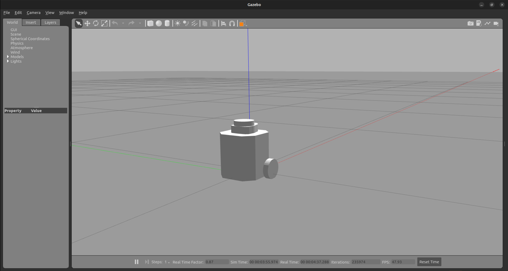
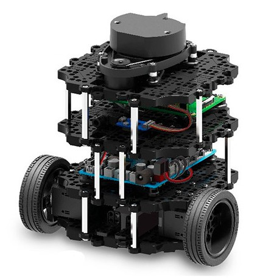
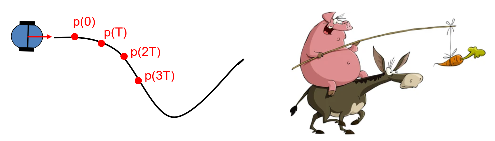
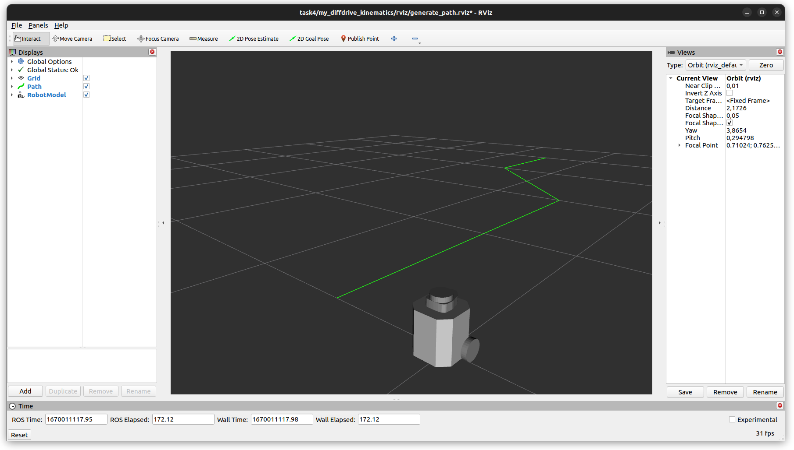

# 4. Kinematische Grundfertigkeiten eines mobilen Roboters

**Hinweis:** Laden Sie sich für diese Aufgabe die neueste Version des Docker-Images.
Evtl. müssen Sie das `install`-, `log`-, und `build`-Verzeichnis in Ihrem ROS2-Workspace löschen.

In dieser Aufgabe werden Sie verschieden kinematische Grundfertigkeiten für einen Roboter mit Differenzialantrieb
implementieren.
Diese implementieren Sie in im Package ```my_diffdrive_kinematics```.
Dieses Package ist in ihrem `task4`-Ordner bereits angelegt. Sie müssen lediglich die Implementierung in den
entsprechenden Dateien vornehmen.

Außerdem werden Sie lernen, wie Sie in ROS2:

* die Robotersimulation Gazebo verwenden
* einen mobilen Roboter ansteuern
* Argumente beim Aufruf eines Nodes übergeben
* Launch Files verwenden
* Parameter Files verwenden

**Abgabe:** Erstellen Sie für die Bearbeitung einen Branch `task4` und implementieren Sie ihre Lösung in diesem Branch.
Sobald Sie fertig sind, stellen Sie einen Merge-Request gegen den Branch `master`.
Die Abgabe gilt als bestanden, wenn die CI-Tests ohne Fehler durchlaufen und der Merge-Request akzeptiert wurde.

**Deadline:** Der Merge-Request muss bis zum 10. Januar 2023 um 23:59 erstellt worden sein.

## 4.1 Installation der Simulationsumgebung für den Turtlebot3-Roboter

Für diese Aufgabe verwenden Sie die Simulation des Turtlebot3-Roboters im Gazebo-Simulator.
Klonen Sie hierfür folgendes Repository in Ihren Source-Ordner im ROS2-Workspace (```ros2_ws/src```).

```bash
cd ~/ros2_ws/src
git clone -b humble-devel https://github.com/mblaich/turtlebot3_simulations.git
```

<details>
<summary><b>Hinweis:</b> Für alle, die das Docker-Image nicht verwenden, sind weitere Installationsschritte notwendig. 
Klicken Sie <b>hier</b> um die benötigten Informationen zu erhalten.</summary>

Sie müssen in Ihrer `.bashrc` die Umgebungsvariable für das Turtlebot-Modell setzen und noch die benötigten Packages für
die Simulation installieren.

```bash
echo "export TURTLEBOT3_MODEL=burger" >> ~/.bashrc
sudo apt install ros-humble-turtlebot3-msgs
```

</details>


Bauen Sie die Turtlebot3-Packages im Workspace ```ros2_ws``` mit:

```bash
cd ~/ros2_ws
colcon build --symlink-install
source install/setup.bash
```

Die Turtlebot3-Simulation starten Sie über folgendes launch file:

```
ros2 launch turtlebot3_gazebo empty_world.launch.py
```

Das Starten des Simulators kann unter Umständen auch länger dauern.
Um den Roboter in der Simulation zu steuern, starten Sie in einem zweiten Terminal:

```
ros2 run teleop_twist_keyboard teleop_twist_keyboard
```

<p float="left" style="text-align: center">
    
    
</p>

## 4.2 ROS2 Nodes zur Steuerung eines mobilen Roboters

In dieser Aufgabe lernen Sie wie man einen mobilen Roboter in ROS steuert und Informationen über die Roboterbewegung vom
Simulator abfragt.
Implementieren Sie hierfür im Package ```my_diffdrive_kinematics``` zwei Nodes ```straight_drive```
und ```curve_drive```.

Der erste Node ```straight_drive``` soll den Roboter auf einer geraden Strecke bewegen.
Dabei sollen die Geschwindigkeit $`v`$ und die Länge der zurückzulegenden Strecke $`distance`$
als Argumente übergeben werden.
Wurde die Zieldistanz erreicht, soll dem Roboter der Befehl zum Anhalten gesendet werden.
Fragen Sie hierzu die vom Roboter zurückgelegte Strecke über das ```/odom```-Topic ab.
Ignorieren Sie hierbei, dass der Turtlebot noch etwas weiterrollt.
Anschließend soll sich der Node so beenden, dass das Terminal, in dem der Node gestartet wurde, direkt wieder verwendet
werden kann.
Der Node soll über folgenden Befehl gestartet werden:

```bash
ros2 run my_diffdrive_kinematics straight_drive --ros-args -p v:=0.2 -p distance:=2.0
```

Der zweite Node ```curve_drive``` soll den Roboter auf einem Kreisbogen mit einer Geschwindigkeit $`v`$ bewegen.
Der Kreisbogen ist dabei über seinen Radius $`r`$ und den Winkel $`\alpha`$ definiert.
Hat der Roboter den Kreisbogen abgefahren, soll er anhalten.
Dies erreichen Sie in dem Sie sowohl Lateral- als auch Winkelgeschwindigkeit auf 0 setzen.
Ist der Kreisbogen abgefahren und der Roboter angehalten (also die Geschwindigkeiten 0 gesendet), soll sich der Node
wieder beenden.
Bei einem positiven Winkel $`\alpha`$ soll der Roboter eine Linkskurve und bei negativem $`\alpha`$ eine Rechtskurve
fahren.
Bei einem Winkel $`\alpha=0.0`$ soll sich der Roboter auf einem Kreis bewegen.
Hier wird der Node dann nicht beendet, sondern der Roboter fährt einfach immer weiter im Kreis.
Gestartet wird der Node über folgenden Befehl:

```bash
ros2 run my_diffdrive_kinematics curve_drive --ros-args -p v:=0.2 -p r:=1.0 -p alpha:=1.2
```

Hierbei werden die Geschwindigkeit $`v`$ in [m/s], der Radius $`r`$ in [m] und der Winkel $`\alpha`$ in [rad] übergeben.

### Hinweise und Hilfen zur Implementierung

**Interface zum Roboter**

Fahrbefehle können an den Roboter mit einer ```geometry_msgs/msg/Twist```-Message über das Topic ```/cmd_vel``` gesendet
werden.
Über das ```/odom```-Topic können Sie eine ```nav_msgs/msg/Odometry```-Message empfangen.
In dieser Message ist zum einen die Pose des Roboters in Bezug zu einem globalen Weltkoordinatensystem enthalten,
als auch die Geschwindigkeiten des Roboters, bezogen auf das lokale Roboterkoordinatensystem, bei dem die x-Achse nach
vorne zeigt.
Dokumentation zu den Messages finden Sie unter:

* https://docs.ros2.org/galactic/api/geometry_msgs/msg/Twist.html
* https://docs.ros2.org/galactic/api/nav_msgs/msg/Odometry.html

**Übergabe von ROS-Argumenten an Nodes**

Die Argumentübergabe ist in ROS2 über Parameter gelöst.
Diese Parameter geben Sie beim Aufruf eines Nodes dadurch an, dass Sie nach dem Nodename
zusätzlich ```--ros-args -p param_name``` angeben.
Sie können so auch mehrere Argumente übergeben.
In Ihrem Node können Sie die Argumente anschließend wie folgt abfragen:

```python
from rclpy.node import Node


class StraightDrive(Node):
    def __init__(self):
        super().__init__("straight_drive_node")

        self.target_reached = False  

        self.declare_parameter("v", 0.0)
        self.declare_parameter("distance", 0.0)

        self.velocity = self.get_parameter("v").get_parameter_value().double_value
        self.target_distance = self.get_parameter("distance").get_parameter_value().double_value
        self.get_logger().info("v: " + str(self.velocity))
        self.get_logger().info("distance: " + str(self.target_distance))
```

**Beenden eins Nodes**

Folgendes Code-Beispiel zeigt, wie sie einen Node beenden, sobald dieser seine Aufgabe erledigt hat.
Hierfür wird eine while-Schleife in `main` implementiert, die mittels Flag überprüft, ob der Node weiter ausgeführt
werden muss.

```python
def main(args=None):
    rclpy.init(args=args)
    straight_drive = StraightDrive()

    while not straight_drive.target_reached:  # Abfragen, ob das Flag gesetzt wurde, dass das Ziel erreicht ist
        rclpy.spin_once(straight_drive)

    rclpy.shutdown() 
```

### Zusatzaufgabe:

Das Lösen dieser Aufgabe ist freiwillig und wird bei der Abgabe nicht überprüft. Es existieren ebenfalls keine CI-Tests.

Implementieren Sie einen dritten Node ```lane_change```, der einen Fahrspurwechsel realisiert.
Dabei soll der Roboter zuerst einen Meter geradeaus fahren und dann einen Fahrspurwechsel mit Abstand $`d`$,
zwischen beiden Spuren, und einem Radius $`r`$, für die Kreisbögen, realisieren.
Der Roboter soll das gesamte Manöver mit Geschwindigkeit $`v`$ ausführen.

```bash
ros2 run my_diffdrive_kinematics lane_change --ros-args -p v:=0.2 -p r:=1.0 -p d:=1.2
```

## 4.3. Anfahren eines Zielpunktes mit einem Regler

In dieser Aufgabe implementieren Sie ihren ersten Regler für einen Roboter mit Differenzialantrieb.
Erstellen Sie hierfür einen Node ```approach_goal```, der den Roboter auf den Punkt $`p`$ zusteuert.
$`p`$ muss dabei lediglich mit einer gewissen Toleranz $`tol`$ erreicht werden.
Implementieren Sie hierfür einen Regler, der, wie in der Vorlesung besprochen, die Lateral- und Winkelgeschwindigkeit
entsprechend dem Abstand und dem Ausrichtungsfehler regelt (Folie 3-38).

```bash
ros2 run my_diffdrive_kinematics approach_goal --ros-args -p x:=1.5 -p y:=1.0 -p tol:=0.1 -p v_max:=0.25 -p omega_max:=2.5
```

Um Ihren Regler besser einstellen zu können, bietet es sich an die Regelparameter $`K_v`$ und $`K_\omega`$ ebenfalls
als Parameter zu übergeben. Wählen Sie dementsprechend sinnvolle default-Werte.

## 4.4 Implementierung des Carrot-Donkey-Verfahrens

<p float="left" style="text-align: center">
    
</p>

In dieser Aufgabe werden Sie das Carrot-Donkey-Verfahren implementieren, um den Roboter entlang eines vordefinierten
Pfades zu steuern.
Hierfür müssen Sie zwei Nodes implementieren: Eine ```generate_path```-Node und eine ```follow_path```-Node.
Außerdem lernen Sie die Verwendung von ROS2-launch-Dateien und ROS2-Parameter-Dateien.

In der ```generate_path```-Node lesen Sie Wegpunkte über ROS Parameter ein und generieren
daraus einen Pfad.
Diesen senden Sie dann über das ```/path```-Topic an die ```follow_path```-Node.
Die Koordinaten der Wegpunkte können sie im Node wie folgt einlesen.
```
self.get_parameter("waypoints_x").get_parameter_value().double_array_value
self.get_parameter("waypoints_y").get_parameter_value().double_array_value
```

Der zu erzeugende Pfad muss aus einer Sequenz einzelner Posen bestehen.
Dabei ist darauf zu achten, dass immer ca. 0,1 m Abstand zwischen den einzelnen Posen ist.
Um dies zu erreichen, müssen Sie die Strecken zwischen den einzelnen Wegpunkten interpolieren und neue Posen einfügen.
Die Orientierung der Posen können Sie in dieser Aufgabe vernachlässigen.
Die Koordinaten der Wegpunkte erhalten Sie aus dem Parameter-File ``default_path.yaml``, welches im ``config``-Ordner
liegt und bei Verwendung des bereitgestellten launch files automatisch geladen wird.
Sie können hier auch eigene Dateien mit eigenen Wegpunkten ablegen.

Der Pfad mit den interpolierten Posen wird dann jede Sekunde als ``nav_msgs/Path``-Message über das ``/path`` Topic
versendet.
Achten sie beim Anlegen der ``nav_msgs/Path``-Message darauf, dass Sie im Header auch das richtige
Koordinatensystem, auf welches sich der Pfad bezieht, eintragen.
Für diese Übung ist dies der ``odom`` Frame.

```python
from nav_msgs.msg import Path

...

path = Path()
path.header.frame_id = "odom"
path.header.stamp = self.get_clock().now().to_msg()
```

Die Definition der ``nav_msgs/Path``-Message finden Sie unter:

* https://docs.ros2.org/galactic/api/nav_msgs/msg/Path.html

Im launch-Verzeichnis befindet sich das launch file ``generate_path.launch.py``,
welches die Inhalte der `default_path.yaml` als Parameter lädt und Ihrem Node zur Verfügung stellt.
Das launch file bietet die Möglichkeit neben ihrem Node auch Gazebo und/oder Rviz zu starten.

```bash
ros2 launch my_diffdrive_kinematics generate_path.launch.py
```

Sie können in einem zweiten Terminal RViz starten, um ihren Pfad anzuzeigen.
Ein entsprechendes launch file ist vorbereitet:

```bash
ros2 launch my_diffdrive_kinematics rviz.launch.py
```

Wenn Sie in einem weiteren Terminal auch noch die Gazebo-Simulation des Turtlebot starten, können sie diesen auch in
RViz sehen.

```bash
ros2 launch turtlebot3_gazebo empty_world.launch.py
```

<p float="left" style="text-align: center">
    
</p>


Im zweiten Node ```follow_path``` implementieren Sie den Carrot-Donkey-Algorithmus aus der Vorlesung (Folie 3-41).
Hierzu erstellen Sie im Node einen Subscriber auf das ``/path``-Topic.
Sobald der Node einen Pfad empfangen hat, steuert er den Roboter entlang des Pfads und nimmt keine neuen Pfade an.
Ist der Roboter am Ende des Pfades angekommen stoppen Sie den Roboter wieder und beenden den Node.

Der Carrot-Donkey-Algorithmus verwendet einen vorauseilenden Punkt $`p`$.
Dieser bewegt sich mit einer konstanten Geschwindigkeit $`v_p`$ entlang des Pfades.
Diese Geschwindigkeit des vorauseilenden Punktes wird über den Parameter $`v_p`$ im launch file an den Node übergeben.
Der Roboter soll dann diesem Punkt mit einem möglichst konstanten Abstand $`d^*`$ folgen.
Verwenden Sie für diesen Abstand $`d^*`$ ebenfalls einen Parameter `d_star`.
Diesen müssen Sie im launch file noch hinzufügen. Legen Sie einen Wert von ``0.5`` fest, damit der Roboter dem
Punkt mit dem Abstand eines halben Meters folgt.

Um den Abstand $`d^*`$ konstant zu halten muss die Geschwindigkeit des Roboters entsprechend geregelt werden.
Implementieren Sie hierfür wieder einen Regler der die Geschwindigkeit proportional zum Abstand regelt.
Um den Roboter auf den vorauseilenden Punkt zuzusteuern, können Sie die Winkelgeschwindigkeit wie im Regler der
vorherigen Aufgabe berechnen.
Übergeben Sie die Regelparameter $`K_v`$ und $`K_\omega`$ ebenfalls als ROS-Parameter aus dem launch file.

Wählen Sie auch in dieser Aufgabe sinnvolle default-Werte für die Parameter in ihrem Code.

Den ```follow_path```-Node starten Sie wie folgt:

```bash
ros2 launch my_diffdrive_kinematics follow_path.launch.py
```

### Hinweise und Hilfen zur Implementierung

**ROS-Time**

In ROS ist es wichtig, dass sie mit der ROS-Time und nicht mir der Systemzeit des Rechners arbeiten.
Um die aktuelle Zeit in ihrem ROS Node abzufragen, verwenden sie in ROS am besten die ``self.get_clock().now()``
-Methode.
```Python
t = self.get_clock().now()
```

**Visualisierung in RViz**

Sie können in ROS Marker publishen die dann in RViz angezeigt werden.
Dies können Sie z.B. nutzen um Ihren vorauseilenden Punkt anzuzeigen.

Benötigte Includes:
```Python
from visualization_msgs.msg import Marker
from builtin_interfaces.msg import Duration
```

Anlegen des Publishers:
```Python
self.marker_publisher = self.create_publisher(Marker, "carrot", 10)
```

Anlegen eines Markers und Publishen des Markers:
```Python
p_marker = Marker()

p_marker.header.frame_id = "odom"
p_marker.header.stamp = self.get_clock().now().to_msg()
p_marker.ns = ""
p_marker.id = 1
p_marker.lifetime = Duration()
p_marker.type = Marker.SPHERE
p_marker.action = Marker.MODIFY
p_marker.pose.position.x = target.position.x  # Position ihres vorauseilenden Punktes
p_marker.pose.position.y = target.position.y  # Position ihres vorauseilenden Punktes
p_marker.pose.position.z = 0.0
p_marker.pose.orientation.x = 0.0
p_marker.pose.orientation.y = 0.0
p_marker.pose.orientation.z = 0.0
p_marker.pose.orientation.w = 1.0
p_marker.scale.x = 0.1
p_marker.scale.y = 0.1
p_marker.scale.z = 0.1
p_marker.color.a = 1.0  # Don't forget to set the alpha!
p_marker.color.r = 1.0
p_marker.color.g = 0.5
p_marker.color.b = 0.0

self.marker_publisher.publish(p_marker)
```

**Probleme bei --symlink-install für config and launch Dateien**

Leider gibt es in der aktuellen ROS Version ein Problem mit dem  ``--symlink-install`` in Python-Packages.
Für launch files und config-Dateien werden keine Symlinks angelegt.
Stattdessen werden die Dateien in das ``install``-Verzeichnis kopiert.
Sie müssen also nach jeder Änderung in einer config-Datei oder einem launch file ``colcon build --symlink-install``
aufrufen, damit die Änderungen übernommen werden. (https://github.com/colcon/colcon-core/issues/407)

**Probleme beim Beenden von Gazebo**

Es kann ab und zu vorkommen, dass sich Gazebo nicht korrekt beendet, obwohl das Fenster geschlossen wurde.
Dies erkennen Sie etwa, wenn sich der Roboter in RViz noch bewegt, obwohl Sie kein Gazebo gestartet haben, oder wenn
sich Gazebo nicht mehr starten lässt.
Dann empfiehlt es sich zu schauen, ob noch eine Gazebo-Instanz läuft.

```bash
ps -aux | grep gazebo
```

Sie erhalten dann eine ähnliche Ausgabe:

```
mblaich    15490  102  0.5 4431204 280996 pts/1  SLl+ 07:25   0:20 gzserver /home/mblaich/ros2_ws/install/turtlebot3_gazebo/share/turtlebot3_gazebo/worlds/empty_world.world -slibgazebo_ros_init.so -slibgazebo_ros_factory.so -slibgazebo_ros_force_system.so
```

Sie können Gazebo dann über den ``kill`` Befehl mit der entsprechenden PID beenden. In dem Beispiel von oben wäre dies:

```bash
sudo kill -9 15490
```